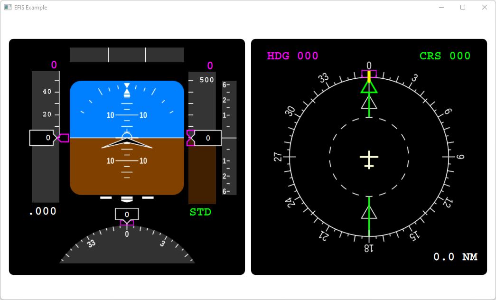

# QmlFlightInstruments
This project is a QML port of [Marek M. Cel](http://marekcel.pl/)'s work [QFlightinstruments](https://github.com/marek-cel/QFlightinstruments).

All SVG files are taken from Marek's repository. Copyright notice is under `Resources` folder. For the details, please visit his repository.

## Build
Simply open `QmlFlightInstruments.pro` with QtCreator and build it. I used Qt 5.15.2, but other versions greater than Qt 5.15 should also work. 
The project contains a QML application in which you can get an insight on how to use this project for your needs.

## Screenshots
### Basic Six

### Electronic Flight Instrument System

## Keywords
QML, GUI, Flight Simulator, Flight Instruments, Airspeed Indicator (ASI), Attitude Indicator (AI), Altimeter (ALT), Turn Coordinator (TC), Heading Indicator (HI), Vertical Speed Indicator (VSI), Electronic Attitude Direction Indicator (EADI), Electronic Horizontal Situation Indicator (EHSI)
